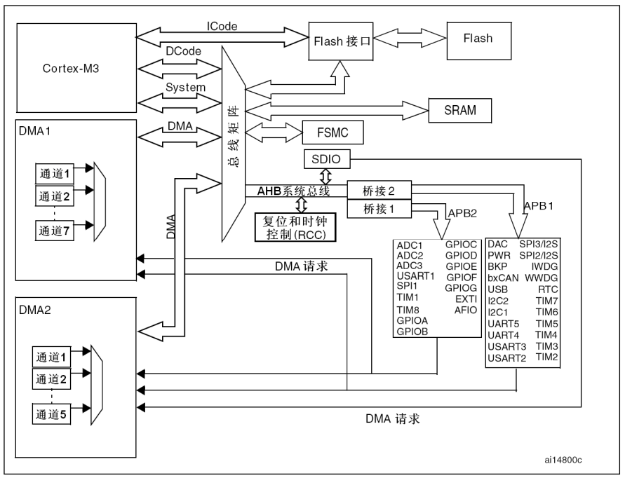
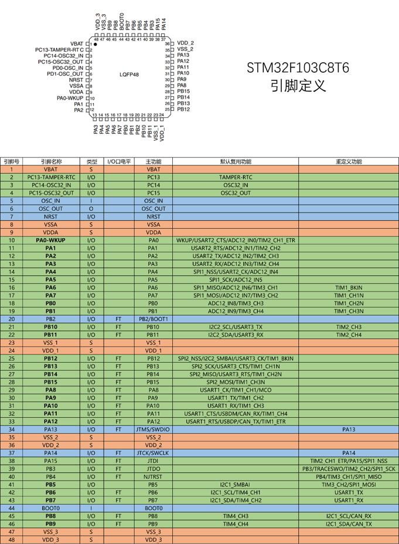

This is a note of STM32 study
%coded in GBK
# 目录
- [目录](#目录)
- [第一章：STM32简介](#第一章stm32简介)
  - [综述](#综述)
  - [STM32F103C8T6](#stm32f103c8t6)
    - [简介](#简介)
    - [Peripheral](#peripheral)
    - [系统结构](#系统结构)
    - [引脚定义](#引脚定义)

# 第一章：STM32简介

## 综述

STM32是ST公司基于 ARM Cortex-M 内核开发的32位微控制器。

关于Cortex系列内核：略

## STM32F103C8T6
### 简介
- 系列：Mainstream STM32F1
- 内核：ARM Cortex M3
- 主频：72MHz
- RAM: 20K(SRAM)
- ROM: 64K(Flash)
- 供电：2.0~3.6V(standard 3.3V)
- 封装：LQFP48
### Peripheral
| Abbreviation |                          Name                          |      Note       |
| :----------: | :----------------------------------------------------: | :-------------: |
|     NVIC     | Nested Vectored Interrupt Controller嵌套向量中断控制器 |    in kernel    |
|   Systick    |                     系统滴答定时器                     |    in kernel    |
|     RCC      |                     复位和时钟控制                     |
|     GPIO     |                        通用IO口                        |
|     AFIO     |                        复用IO口                        |
|     EXTI     |                        外部中断                        |
|     TIM      |                         定时器                         |
|     ADC      |                       模数转换器                       |
|     DMA      |                      直接内存访问                      |
|    USART     |                   同步/异步串口通信                    |
|     I2C      |                        I2C Com                         |
|     SPI      |                        SPI通信                         |
|     CAN      |                        CAN通信                         |
|     USB      |                        USB通信                         |
|     RTC      |                        实时时钟                        |
|     CRC      |                        CRC校验                         |
|     PWR      |                        电源控制                        |
|     BKP      |                       备份寄存器                       |
|     IWDG     |                       独立看门狗                       |
|     WWDG     |                       窗口看门狗                       |
|     DAC      |                       数模转换器                       | not in f103c8t6 |
|     SDIO     |                        SD卡接口                        | not in f103c8t6 |
|     FSMC     |                   可变静态存储控制器                   | not in f103c8t6 |
|   USB OTG    |                      USB主机接口                       | not in f103c8t6 |
### 系统结构

- ICode:指令总线，主要连接FLASH，加载程序指令
- DCode:数据总线，主要连接FLASH，加载数据
- System:系统总线，连接SRAM,FSMC等其他外设
- AHB系统总线：用于挂载主要外设
### 引脚定义

### 最小系统电路
略

# 第二章:GPIO
略

# 第三章：EXTI外部中断
## 简介
EXTI是APB2总线上的外设，可以监测指定GPIO口的电平信号，当其指定的GPIO口产生电平变化时，EXTI将立即向NVIC发出中断申请，经过NVIC裁决后可以中断主程序，执行对应的EXTI中断程序
